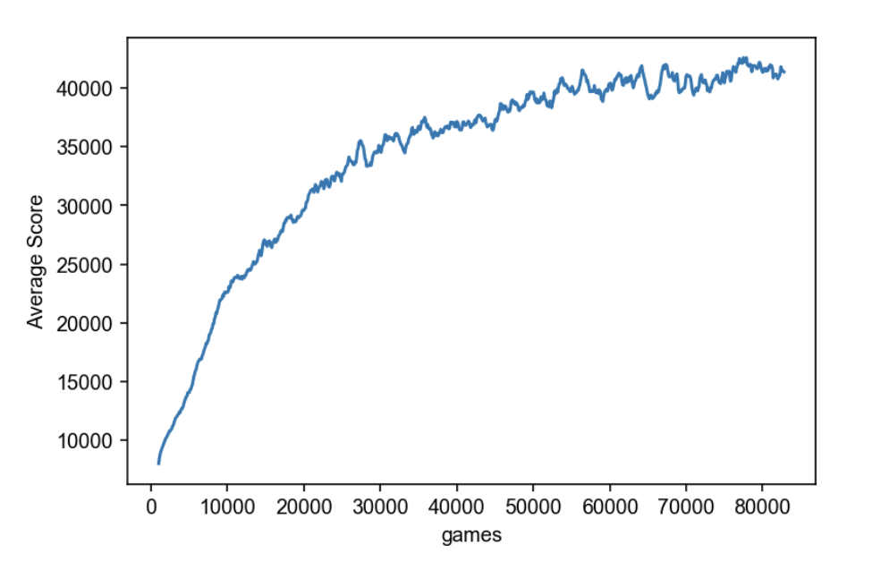

# N-Tuple Networks for the Game 2048 in Python

This repo implements a reinforcement learning agent to learn the game 2048 by optimizing the n-tuple network with Temporal Difference Learning.

A demo of a trained agent playing the game reaching a 2048 tile:

# Performance

Training performance:

# Usage

1. download or clone this repo
2. train an agent `$ python main.py`
3. OR, watch an agent play using the `demo.ipynb` notebook

# Implementation

Steps to master the game 2048:

1. initialize a board
2. determine the best action
3. move the board
4. add a random tile
5. learn from the gameplay

**Representation**

The state -> expected score mapping relationship cannot be represented directly. The game 2048 has about fifty quintillions (50,000,000,000,000,000) states. It is too large to fit in memory. An n-tuple network is introduced to break the board into smaller patterns called "tuples", so each tuple has a feasible number of states to fit in memory. 

The network stores the maximum expected total score to be obtained by playing a board state.

**The best action**

To decide the best action given a board, the network works like an ensemble system by asking each tuple what they think of doing each possible action on the board and taking the average of their opinion as the final output. The action with the highest output is chosen.

**Learning**

The network learns by improving its expected score for a state using the reward from the best action and the expected score of the next state. Concretely, the target score is the action reward plus the expected score on the resulting next state (i.e., *TD(0)*). Since a state learns from the next state, each gameplay is learned backward to enhance the backpropagation of experiences.

# References
Rodgers, Philip, and John Levine. "An investigation into 2048 AI strategies." 2014 IEEE Conference on Computational Intelligence and Games. IEEE, 2014.

Szubert, Marcin, and Wojciech Jaśkowski. "Temporal difference learning of n-tuple networks for the game 2048." 2014 IEEE Conference on Computational Intelligence and Games. IEEE, 2014.

Yeh, Kun-Hao, et al. "Multistage temporal difference learning for 2048-like games." IEEE Transactions on Computational Intelligence and AI in Games 9.4 (2016): 369-380.

Jaśkowski, Wojciech. "Mastering 2048 with delayed temporal coherence learning, multistage weight promotion, redundant encoding, and carousel shaping." IEEE Transactions on Games 10.1 (2017): 3-14.
